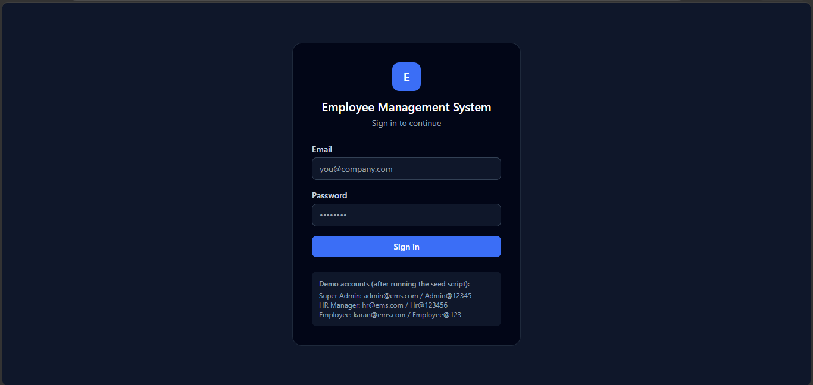
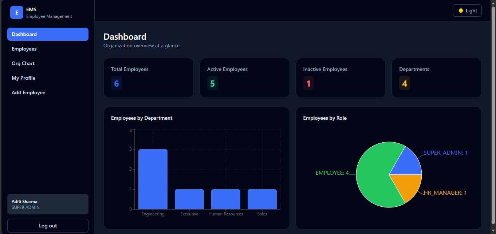
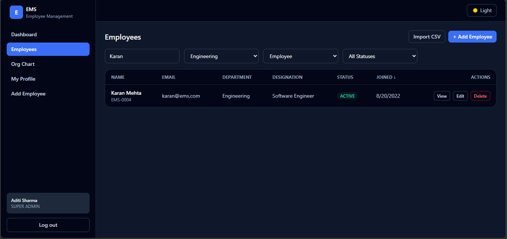
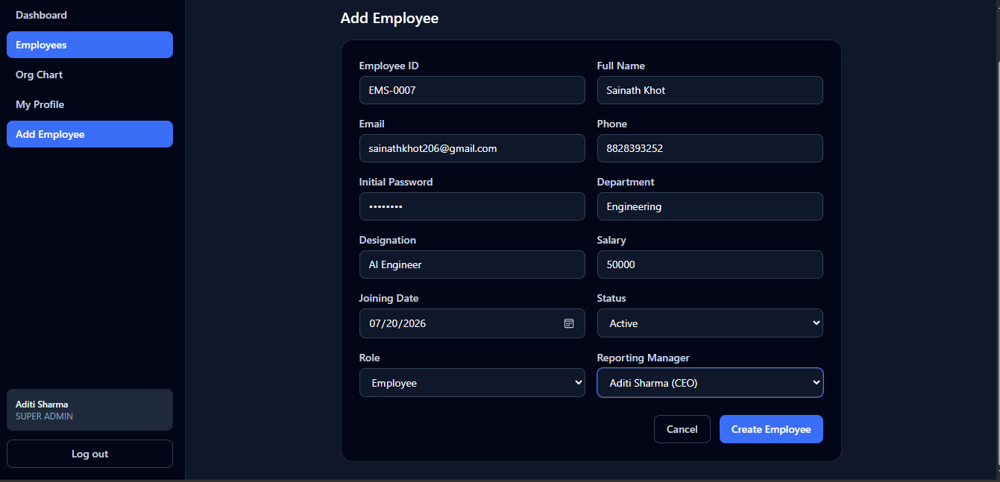
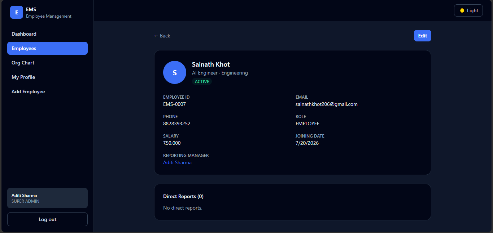
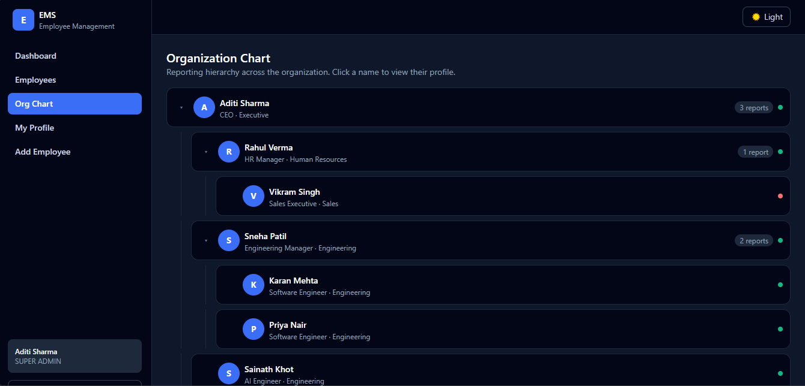
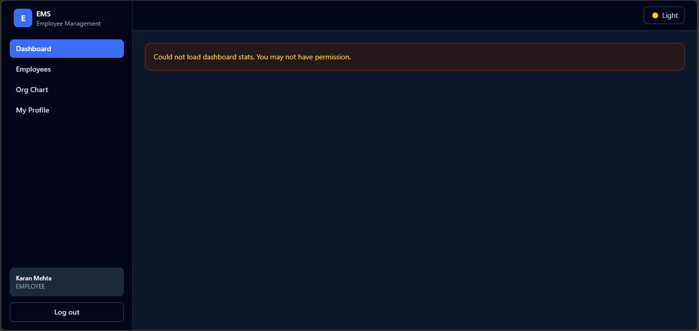
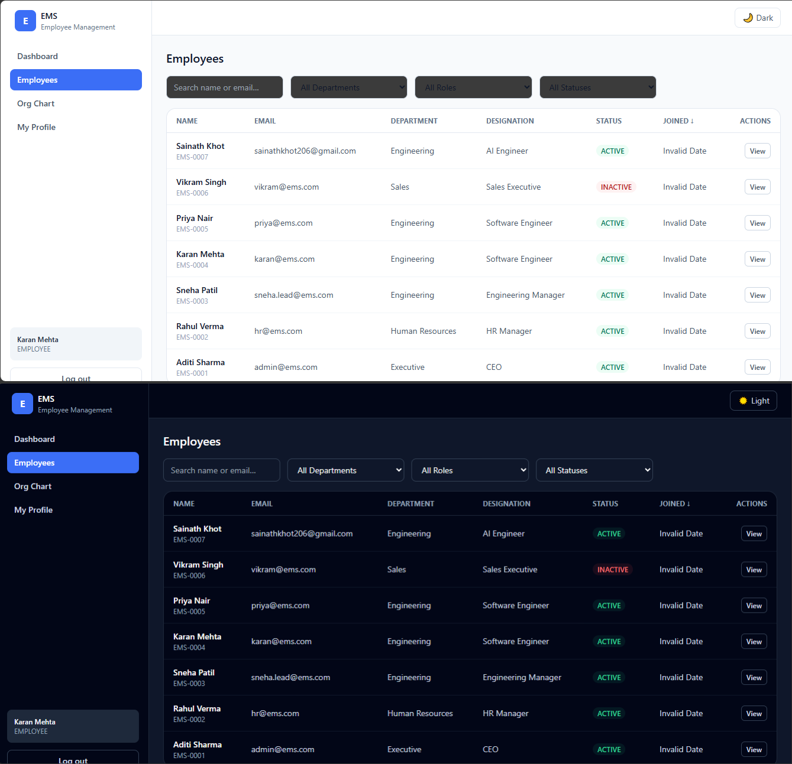

# Employee Management System (EMS)

A full-stack Employee Management System with JWT authentication, role-based
access control, organizational hierarchy management, and a responsive
dashboard.

**Stack:** React + TypeScript + Tailwind CSS (frontend) · Node.js + Express
(backend) · MongoDB + Mongoose (database) · JWT + bcrypt (auth)

---

## 1. Project structure

```
ems/
├── backend/            Express REST API
│   ├── src/
│   │   ├── config/      DB connection
│   │   ├── models/       Mongoose schemas
│   │   ├── middleware/   auth, RBAC, validation, error handling
│   │   ├── controllers/  business logic
│   │   ├── routes/       Express routers
│   │   ├── utils/        JWT helpers, circular-reporting check
│   │   └── seed/         demo data seeding script
│   └── tests/           Jest unit + integration tests
├── frontend/           React + Vite + TypeScript SPA
│   └── src/
│       ├── context/      Auth & Theme (dark mode) providers
│       ├── components/   Layout, ProtectedRoute, StatCard, OrgTreeNode
│       ├── pages/         Login, Dashboard, Employees, Employee form/detail,
│       │                  Org chart, Profile
│       ├── services/      Axios client + typed API endpoints
│       └── types/         Shared TypeScript interfaces
└── docker-compose.yml   Orchestrates MongoDB + backend + frontend
```
## Live Demo

- **Frontend (Netlify):** https://ems-sainath.netlify.app
- **Backend API (Render):** https://ems-backend-agtu.onrender.com/api
- **Note:** the backend is on Render's free tier, which spins down after 15 min of inactivity. The first request after idle may take 30–60 seconds to wake up — this is expected, not a bug.

### Demo accounts
| Role | Email | Password |
|------|-------|----------|
| Super Admin | admin@ems.com | Admin@12345 |
| HR Manager | hr@ems.com | Hr@123456 |
| Employee | karan@ems.com | Employee@123 |

## Screenshots

| | |
|---|---|
| **Login**  | **Dashboard**  |
| **Employees**  | **Add Employee**  |
| **Employee Detail**  | **Org Chart**  |
| **Employee View**  | **Dark Mode**  |

## 2. Quick start (Docker — recommended)

```bash
git clone <this-repo>
cd ems
docker compose up --build
```

- Frontend: http://localhost:5173
- Backend API: http://localhost:5000/api
- MongoDB: localhost:27017 (persisted in a named volume)

Then seed demo data (once containers are up):

```bash
docker compose exec backend npm run seed
```

## 3. Quick start (manual / local development)

### Backend

```bash
cd backend
cp .env.example .env      # edit MONGO_URI, JWT secrets etc.
npm install
npm run seed              # optional: creates demo accounts
npm run dev                # nodemon, http://localhost:5000
```

Requires a running MongoDB instance (local install or MongoDB Atlas). Update
`MONGO_URI` in `.env` accordingly.

### Frontend

```bash
cd frontend
cp .env.example .env       # set VITE_API_URL if backend isn't on :5000
npm install
npm run dev                 # http://localhost:5173
```

## 4. Demo accounts (after `npm run seed`)

| Role         | Email             | Password       |
|--------------|-------------------|----------------|
| Super Admin  | admin@ems.com     | Admin@12345    |
| HR Manager   | hr@ems.com        | Hr@123456      |
| Employee     | karan@ems.com     | Employee@123   |

## 5. Authentication design

- **Access token** (short-lived JWT, 15 min default) is returned in the login
  response body and kept in memory on the frontend (not localStorage), attached
  to requests via an `Authorization: Bearer` header.
- **Refresh token** (7 days default) is set as an `httpOnly`, `sameSite=lax`
  cookie scoped to `/api/auth`, so it's inaccessible to JavaScript (XSS-safer)
  and is used only to silently mint new access tokens via
  `POST /api/auth/refresh`. The frontend's Axios interceptor automatically
  retries a request once after a silent refresh on a 401.
- Passwords are hashed with **bcrypt** (10 salt rounds) and never returned in
  any API response.
- `POST /api/auth/login` is rate-limited (20 attempts / 15 min per IP) to slow
  down credential stuffing.

## 6. Role-based access control (RBAC)

| Capability                              | Super Admin | HR Manager | Employee |
|------------------------------------------|:-----------:|:----------:|:--------:|
| View employee directory                  | ✅          | ✅         | ✅ (limited fields) |
| View own profile                         | ✅          | ✅         | ✅       |
| View any single employee's full profile   | ✅          | ✅         | ❌ (own only) |
| Create employee                          | ✅          | ✅         | ❌       |
| Edit any employee                        | ✅          | ✅ (not role/manager) | ❌ |
| Edit own profile (phone, photo only)     | ✅          | ✅         | ✅       |
| Assign Super Admin role                  | ✅          | ❌         | ❌       |
| Delete (soft-delete) employee            | ✅          | ❌         | ❌       |
| Assign / change reporting manager        | ✅          | ✅ (via dedicated endpoint) | ❌ |
| View dashboard stats                     | ✅          | ✅         | ❌       |
| CSV import                                | ✅          | ✅         | ❌       |

RBAC is enforced **server-side** in middleware/controllers (the source of
truth) and mirrored in the UI so users don't see actions they can't perform.

## 7. Organizational hierarchy & circular-reporting prevention

- Each employee has an optional `reportingManager` reference to another
  employee.
- `GET /api/organization/tree` builds a nested tree from the flat employee
  collection in `organizationController.buildTree`.
- `GET /api/employees/:id/reportees` returns direct reports.
- Before any manager assignment (`PATCH /api/employees/:id/manager`, or a
  `PUT /api/employees/:id` performed by a Super Admin), the server walks the
  proposed manager's chain upward via `utils/circularCheck.js:wouldCreateCycle`
  and rejects the change if the target employee appears anywhere in that
  chain (including self-assignment). This function is pure and covered by
  dedicated unit tests independent of the database.
- On deletion, an employee's direct reports are automatically re-parented to
  that employee's own manager, so the tree never has dangling references.

## 8. Validation

- **Frontend:** HTML5 required/type constraints plus inline error rendering
  from API validation responses.
- **Backend:** `express-validator` on all write routes (email format, phone
  pattern, salary ≥ 0, required fields, valid Mongo ObjectIds, enum checks for
  role/status) plus Mongoose schema-level validation as a second line of
  defense. Validation errors return `400` with a structured `errors` array.

## 9. Bonus features implemented

- ✅ Pagination (`page`, `limit` query params, capped at 100/page)
- ✅ Soft delete (employees are flagged `isDeleted`/`deletedAt` and excluded
  from default queries, rather than being destroyed)
- ✅ CSV import (`POST /api/employees/import`, multipart file upload)
- ✅ Dashboard charts (bar chart by department, pie chart by role — Recharts)
- ✅ Dark mode (class-based Tailwind dark mode, persisted in localStorage)
- ✅ Docker (backend, frontend, and MongoDB all containerized via
  `docker-compose.yml`)
- ✅ Unit tests (circular-reporting logic) and an integration test suite
  (Jest + Supertest + mongodb-memory-server) covering auth and RBAC
- ⬜ Live deployment — left as a follow-up; see "Deploying" below

## 10. Running tests

```bash
cd backend
npm test
```

- `tests/circularCheck.test.js` — pure unit tests for cycle detection, no
  database required.
- `tests/auth.test.js` — integration tests using `mongodb-memory-server`,
  which downloads a small MongoDB binary the first time it runs. This
  requires outbound internet access; if your environment blocks it, point
  `MONGO_URI` at a real MongoDB instance instead and adapt the test setup.

## 11. Deploying

- **Backend:** any Node host (Render, Railway, Fly.io, EC2) + MongoDB Atlas
  free tier. Set the environment variables from `.env.example`.
- **Frontend:** the `frontend/Dockerfile` builds a static bundle served via
  nginx; deploy the image anywhere, or run `npm run build` and host `dist/`
  on any static host (Vercel, Netlify, S3+CloudFront), pointing
  `VITE_API_URL` at your deployed backend.

## 12. API documentation

See [`API_DOCS.md`](./API_DOCS.md) for the full endpoint reference.
